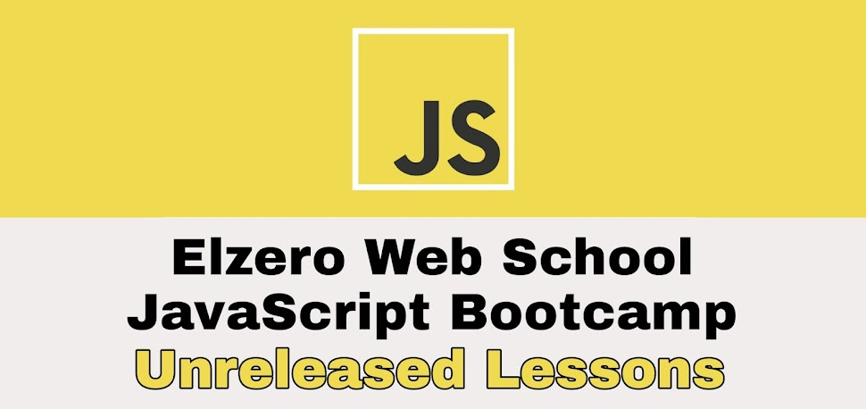

# Elzero Web School - JavaScript Bootcamp Unreleased Lessons

- The plan for all [JavaScript Bootcamp](https://github.com/ElzeroWebSchool/JavaScript_Bootcamp) unreleased lessons
- The main source of the lessons is [Elzero Web School channel](https://www.youtube.com/c/ElzeroInfo) (Old Videos)
- You can watch and study these lessons until new lessons are upload to the channel with its assignments
- It is better to watch the lessons in the same order as the plan and search for the unavailable lessons

## JSON (Recommended)

- [Intro And Why JSON?](https://www.youtube.com/watch?v=CLpmD7hxiBs)
- [Syntax And Data Types](https://www.youtube.com/watch?v=UgqTbbAn_-c)
- [API Overview And JSON Tools](https://www.youtube.com/watch?v=XCaDp94OCHw)
- [Complex JSON Object And Compare With JS](https://www.youtube.com/watch?v=bcok_QP9TuY)
- [Accessing JSON Data](https://www.youtube.com/watch?v=BsPSfqCjh3Y)
- [Parse And Stringify With JavaScript](https://www.youtube.com/watch?v=D_-jeFIhHsc)
- [JSON Encode And Decode With PHP](https://www.youtube.com/watch?v=CmMtNi5xNzY)
- [Practice On Converting Objects And Data](https://www.youtube.com/watch?v=2WXtFtTSafs)

## Asynchronous JavaScript Programming

- [CallStack, WebAPI, Event Loop, Callback Queue](https://www.youtube.com/watch?v=uaphx2xjDKc)
- [Asynchronous vs Synchronous](https://www.youtube.com/watch?v=cJIH3qPR_B8)
- [What Is AJAX ?](https://www.youtube.com/watch?v=6tLeMfOxIyA)
- [Network Requests And Status Code](https://www.youtube.com/watch?v=pUDKGqRJwxU)
- [XMLHTTPRequest Part 1](https://www.youtube.com/watch?v=MaE4Yossouw)
- [XMLHTTPRequest Part 2](https://www.youtube.com/watch?v=zmGcdngmQzU)
- [Loop On Responses](https://www.youtube.com/watch?v=9U_-zrNXG28)
- [Real Life Examples Of AJAX Call](https://www.youtube.com/watch?v=ZsSXDE3R3Ps)
- [Promise Intro](https://www.youtube.com/watch?v=XFMxDnQ561E)
- [Your First Promise](https://www.youtube.com/watch?v=9achN8McQfI)
- [Then And Catch](https://www.youtube.com/watch?v=WB-TmhB6zyU)
- [XHR And Promise](https://www.youtube.com/watch?v=W7ze0GfRbXs)
- [Ignoring The Pyramid Of Doom](https://www.youtube.com/watch?v=gXPA14KDJag)
- [Promise - Fetch And Training](https://www.youtube.com/watch?v=qALCndz0z0g)
- [Promise All And Race](https://www.youtube.com/watch?v=W_GUVg_VPhQ)
- Async (Search for it)
- Await (Search for it)
- Error Handling (Search for it)
- Promise With Async / Await (Search for it)
- Fetch API (Search for it)
- Axios (Search for it)
